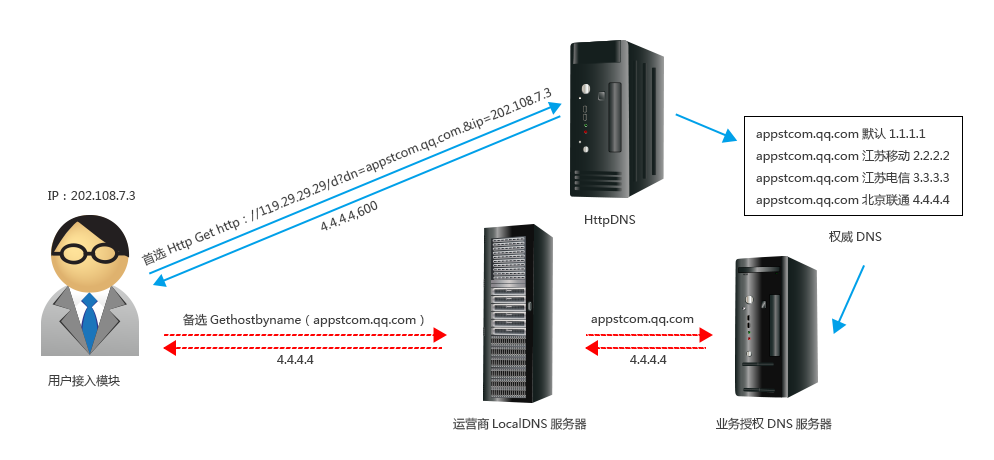
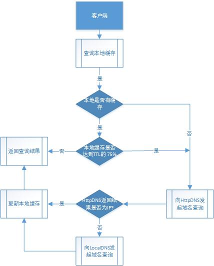

# HttpDNS设计思路

## HttpDns的原理
* HttpDNS是使用HTTP协议向DNS服务器的***80***端口进行请求，代替传统的DNS协议向DNS服务器的***53***端口进行请求,绕开了运营商的Local DNS，从而避免了使用运营商Local DNS造成的劫持和跨网问题。



## 设计策略

### 流程图


#### Failed over策略
* 1.先向httpdns发起域名查询请求
* 2.如果查询返回的结果不是一个IP地址(结果为空、结果为非、连接超时等),则通过LocalDNS
进行域名解析。超时时间建议为5s


### HTTP框架选型
* ngrest 一个简易的C++ SOAP framework.
    * 特点
        * 优点:
            * 占用空间小
            * 相当快
            * 容易使用
        * 缺点:
            * 个人作品，后续是否更新，存疑
            * 使用的是c++11,需要最新的编译器支持(gcc >= 4.8),目前苏宁使用的是4.4.6版本
    * 使用说明
        * 服务端代码
        ```
        class Calculator: public ngrest::Service {
        public:
            int add(int a, int b) {
                return a + b;
            }

            int sub(int a, int b) {
                return a - b;
            }
        };
         ```
         * 客户端代码
         ```
         request: http://localhost:9098/Calculator/add?a=2&b=3
         respond: {"result":5}
         ```
* cpprestsdk 微软作品，提供一组REST风格的API
    * 特点
        * 优点:
            * 丰富的API,包含HTTP client/server, JSON,URI等
            * 跨平台
            * 大厂的作品，品质有保障，目前在github已有954颗星
        * 缺点:
            * 使用的是c++11,需要最新的编译器支持(gcc >= 4.8),目前苏宁使用的是4.4.6版本
            * 依赖boost库
            
* libhttpserver  提供一组REST风格的API(已验证，可以提供服务),安装前需要安装libmicrohttpd库

### Uri请求格式
* "http://***119.29.29.29***/d?dn=www.suning.cn.&ip=1.1.1.1"

    * ***dn***表示要查询的域名
    * ***ip***表示用户ip


### 实现模式
* 从BIND入手，相当于代替用户在TOPDNS上查询,Bind是否支持，待验证???
* 从GSLB-Server入手，拥有基础数据，可以查出用户IP对应的VIP/使用GSLB_Server数据库,GSLB_Server数据库如何做高可用,缓存机制?


### 开发语言
* C/C++ 缺乏相应的框架
* Java 框架丰富
* Python 框架丰富


### 开发问题
* 缓存机制 HTTP+DNS/HTTP+DB
* 域名/GBP-IP/劫持


